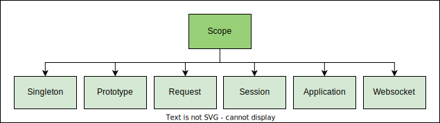
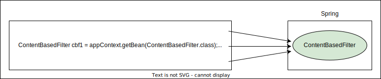
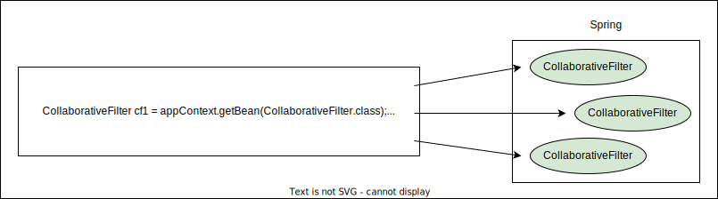

# Guide to Spring 5 and Spring Boot 2.0

[Course Link](https://www.educative.io/module/O7rwGNTE1LJD4RVVx/10370001/5666917543313408)

## Dependency Injection

**Dependency Injection (DI)** is a design pattern used to implement IoC (Inversion of Control), allowing the creation of dependent objects outside a class and providing those objects to a class in various ways. This helps in making the code more modular, testable, and maintainable.

### `@Autowired` Annotation

The `@Autowired` annotation in Spring is used to automatically inject dependencies into a class. When Spring sees this annotation, it looks for a suitable bean (an object managed by the Spring container) to inject into the class.

### Explanation in Context

1. **RecommenderImplementation Class**:
    ```java
    @Component
    public class RecommenderImplementation {
        private final Filter filter;

        @Autowired
        public RecommenderImplementation(Filter filter) {
            this.filter = filter;
        }

        // Other methods...
    }
    ```
2. **Filter Interface**:
    ```java
    public interface Filter {
      String[] getRecommendations(String movie);
    }
    ```
3. **ContentBasedFilter Class**:
    ```java
    @Component
    public class ContentBasedFilter implements Filter {
        public String[] getRecommendations(String movie) {
            // Logic of content-based filter
            return new String[] {"Happy Feet", "Ice Age", "Shark Tale"};
        }
    }
    ```

### How It Works

1. **Defining the Dependency**:
    - The `RecommenderImplementation` class has a dependency on the `Filter` interface. This is indicated by the `private final Filter filter;` field and the constructor that takes a `Filter` object as a parameter.
2. **Using @Autowired**:
    - The `@Autowired` annotation on the constructor tells Spring that it needs to inject a `Filter` implementation when creating an instance of `RecommenderImplementation`.
3. **Component Scanning**:
    - The `@Component` annotation on both `RecommenderImplementation` and `ContentBasedFilter` classes tells Spring to manage these classes as beans. When the Spring application context is initialized, Spring will create instances of these classes.
4. **Injecting the Dependency**:
    - When Spring creates an instance of `RecommenderImplementation`, it will look for a bean that implements the `Filter` interface. In this case, it finds the `ContentBasedFilter` bean.
    - Spring then injects the `ContentBasedFilter` instance into the `RecommenderImplementation` constructor.

### Summary

- **Filter is a Dependency**: The `Filter` interface is a dependency of the `RecommenderImplementation` class because `RecommenderImplementation` needs an object that implements `Filter` to function.
- **@Autowired**: The `@Autowired` annotation tells Spring to automatically inject the appropriate `Filter` implementation (in this case, `ContentBasedFilter`) into the `RecommenderImplementation` class.
- **Spring Container**: Spring manages the creation and injection of these objects, making the code loosely coupled and easier to manage.

---

## Bean Scopes

The Spring container manages beans. The term bean scope refers to the lifecycle and the visibility of beans. It tells how long the bean lives, how many instances of the bean are created, and how the bean is shared.

## Types of bean scopes[#](https://www.educative.io/module/page/O7rwGNTE1LJD4RVVx/10370001/5666917543313408/4548361560784896#Types-of-bean-scopes)

There are six types of scopes: singleton, prototype, request, session, application, and websocket.



The singleton and prototype scopes can be used in any application while the last four scopes are only available for a web application. In this lesson, we will focus on singleton and prototype bean scopes only.

### Singleton scope[#](https://www.educative.io/module/page/O7rwGNTE1LJD4RVVx/10370001/5666917543313408/4548361560784896#Singleton-scope)

The **default scope** of a bean is **singleton**, in which **only one instance of the bean is created and cached in memory**. Multiple requests for the bean return a shared reference to the same bean. In contrast, **prototype** scope results in the **creation of new beans whenever a request for the bean is made to the application context**.

In our movie recommendation system example, we have two implementations of the `Filter` interface, namely `ContentBasedFilter` and `CollaborativeFilter`. We will use them to show the differences between singleton and prototype bean scope.

For the code example shown in this lesson, we have created a sub-package called `lesson8` inside the package `com.domhallan.movierecommendersystem`. The package contains `MovieRecommenderSystemApplication.java`, `Filter.java`, `ContentBasedFilter.java`, and `CollaborativeFilter.java` files.

Application context manages the beans, and we can retrieve a bean using the 
`getBean()` method. If we request the application context for the `ContentBasedFilter` bean three times as shown, we get the same bean:

```java
package com.domhallan.movierecommendersystem.lesson8;

import org.springframework.boot.SpringApplication;
import org.springframework.boot.autoconfigure.SpringBootApplication;
import org.springframework.context.ApplicationContext;

@SpringBootApplication
public class MovieRecommenderSystemApplication {

	public static void main(String[] args) {
		
		//ApplicationContext manages the beans and dependencies
		ApplicationContext appContext = SpringApplication.run(MovieRecommenderSystemApplication.class, args);

		//Retrieve singleton bean from application context thrice
		ContentBasedFilter cbf1 = appContext.getBean(ContentBasedFilter.class);	
		ContentBasedFilter cbf2 = appContext.getBean(ContentBasedFilter.class);	
		ContentBasedFilter cbf3= appContext.getBean(ContentBasedFilter.class);	
					
		System.out.println(cbf1);
		System.out.println(cbf2);
		System.out.println(cbf3);
	}
}
```

Output:

```shell
  .   ____          _            __ _ _
 /\\ / ___'_ __ _ _(_)_ __  __ _ \ \ \ \
( ( )\___ | '_ | '_| | '_ \/ _` | \ \ \ \
 \\/  ___)| |_)| | | | | || (_| |  ) ) ) )
  '  |____| .__|_| |_|_| |_\__, | / / / /
 =========|_|==============|___/=/_/_/_/

 :: Spring Boot ::                (v3.3.0)

2024-05-24T08:03:53.781-04:00  INFO 6384 --- [movie-recommender-system] [           main] .d.m.l.MovieRecommenderSystemApplication : Starting MovieRecommenderSystemApplication using Java 17.0.7 with PID 6384 (/Users/domhallan/learning/educative/guide-to-spring-boot/movie-recommender-system/target/classes started by domhallan in /Users/domhallan/learning/educative/guide-to-spring-boot/movie-recommender-system)
2024-05-24T08:03:53.782-04:00  INFO 6384 --- [movie-recommender-system] [           main] .d.m.l.MovieRecommenderSystemApplication : No active profile set, falling back to 1 default profile: "default"
Constructor invoked...
Setter method invoked..
2024-05-24T08:03:53.953-04:00  INFO 6384 --- [movie-recommender-system] [           main] .d.m.l.MovieRecommenderSystemApplication : Started MovieRecommenderSystemApplication in 0.291 seconds (process running for 0.528)
com.domhallan.movierecommendersystem.lesson8.ContentBasedFilter@3b8ee898
com.domhallan.movierecommendersystem.lesson8.ContentBasedFilter@3b8ee898
com.domhallan.movierecommendersystem.lesson8.ContentBasedFilter@3b8ee898

Process finished with exit code 0
```
As can be verified from the output, all beans are the same. The application context did not create a new bean when we requested it the second and third time. Rather, it returned the reference to the bean already created. Pictorially, it can be shown as follows:



Singleton bean scope is the default scope. It is used to minimize the number of objects created. Beans are created when the context is loaded and cached in memory. All requests for a bean are returned with the same memory address. This type of scope is best suited for cases where stateless beans are required. On the contrary, prototype bean scope is used when we need to maintain the state of the beans.

### Prototype scope[#](https://www.educative.io/module/page/O7rwGNTE1LJD4RVVx/10370001/5666917543313408/4548361560784896#Prototype-scope)

Now we will change the scope of the `CollaborativeFilter` bean from 
singleton to prototype. For this, we will use the `@Scope` annotation and 
import `org.springframework.context.annotation.Scope` and `org.
springframework.beans.factory.config.ConfigurableBeanFactory`. We can 
specify the scope in the two ways. `@Scope("prototype")` or `@Scope
(ConfigurableBeanFactory.SCOPE_PROTOTYPE)`. Here is the updated code:

```java
package com.domhallan.movierecommendersystem.lesson8;

import org.springframework.context.annotation.Scope;
import org.springframework.stereotype.Component;

/**
 * Collaborative filtering implementation of the Filter interface
 */
@Component
@Scope("prototype")
public class CollaborativeFilter implements Filter {

   /**
    * Provides movie recommendations based on collaborative filtering.
    *
    * @param movie - the movie for which recommendations are needed.
    * @return array of recommended movie titles.
    */
   public String[] getRecommendations(String movie) {
      //logic of content based filter
      return new String[] {"Happy Feet", "Ice Age", "Shark Tale"};
   }
}
```

```shell
  .   ____          _            __ _ _
 /\\ / ___'_ __ _ _(_)_ __  __ _ \ \ \ \
( ( )\___ | '_ | '_| | '_ \/ _` | \ \ \ \
 \\/  ___)| |_)| | | | | || (_| |  ) ) ) )
  '  |____| .__|_| |_|_| |_\__, | / / / /
 =========|_|==============|___/=/_/_/_/

 :: Spring Boot ::                (v3.3.0)

2024-05-24T08:13:45.775-04:00  INFO 19928 --- [movie-recommender-system] [           main] .d.m.l.MovieRecommenderSystemApplication : Starting MovieRecommenderSystemApplication using Java 17.0.7 with PID 19928 (/Users/domhallan/learning/educative/guide-to-spring-boot/movie-recommender-system/target/classes started by domhallan in /Users/domhallan/learning/educative/guide-to-spring-boot/movie-recommender-system)
2024-05-24T08:13:45.777-04:00  INFO 19928 --- [movie-recommender-system] [           main] .d.m.l.MovieRecommenderSystemApplication : No active profile set, falling back to 1 default profile: "default"
Constructor invoked...
Setter method invoked..
2024-05-24T08:13:45.954-04:00  INFO 19928 --- [movie-recommender-system] [           main] .d.m.l.MovieRecommenderSystemApplication : Started MovieRecommenderSystemApplication in 0.295 seconds (process running for 0.478)
com.domhallan.movierecommendersystem.lesson8.ContentBasedFilter@4564e94b
com.domhallan.movierecommendersystem.lesson8.ContentBasedFilter@4564e94b
com.domhallan.movierecommendersystem.lesson8.ContentBasedFilter@4564e94b
com.domhallan.movierecommendersystem.lesson8.CollaborativeFilter@45673f68
com.domhallan.movierecommendersystem.lesson8.CollaborativeFilter@27abb83e
com.domhallan.movierecommendersystem.lesson8.CollaborativeFilter@69e308c6

Process finished with exit code 0
````

This time the application context will return three different objects. It will create a new object every time we invoke the getBean() method.



Spring creates a singleton bean even before we ask for it while a prototype bean is not created till we request Spring for the bean. In the code widget below, we will print a message in the `ContentBasedFilter` and `CollaborativeFilter` constructors and comment everything in the main method. When the application is run, the output shows that Spring has created a `ContentBasedFilter` bean but the CollaborativeFilter bean has not yet been created.

```java
package com.domhallan.movierecommendersystem.lesson8;
import org.springframework.boot.SpringApplication;
import org.springframework.boot.autoconfigure.SpringBootApplication;
import org.springframework.context.ApplicationContext;

@SpringBootApplication
public class MovieRecommenderSystemApplication {

	public static void main(String[] args) {
		//ApplicationContext manages the beans and dependencies
		ApplicationContext appContext = SpringApplication.run(MovieRecommenderSystemApplication.class, args);
  }
}
```

### Spring vs. Gang of Four singleton[#](https://www.educative.io/module/page/O7rwGNTE1LJD4RVVx/10370001/5666917543313408/4548361560784896#Spring-vs-Gang-of-Four-singleton)

It is important to note that there is a difference between the Spring singleton and the Gang of Four (GoF) singleton design patterns. The singleton design pattern as specified by the GoF means one bean per JVM. However, in Spring it means one bean per application context. By the GoF definition, even if there were more than one application contexts running on the same JVM, there would still be only one instance of the singleton class.
